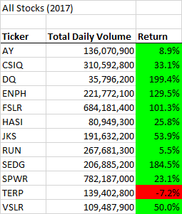
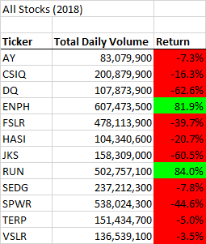
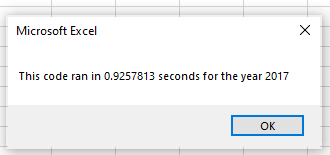
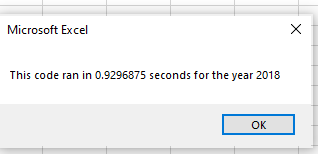
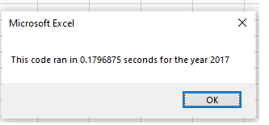

# Stock Analysis -Refactoring
Module 2 Challenge

## Overview of Project
### Purpose
The goal of this project was to refactor the Stock Analysis Excel VBA so the code would run more efficiently with a much larger data set.

### Background
Steve loves the workbook you prepared for him. At the click of a button, he can analyze an entire dataset. Now, to do a little more research for his parents, he wants to expand the dataset to include the entire stock market over the last few years. Although your code works well for a dozen stocks, it might not work as well for thousands of stocks. And if it does, it may take a long time to execute.

In this challenge, you’ll edit, or refactor, the Module 2 solution code to loop through all the data one time in order to collect the same information that you did in this module. Then, you’ll determine whether refactoring your code successfully made the VBA script run faster. Finally, you’ll present a written analysis that explains your findings.

Refactoring is a key part of the coding process. When refactoring code, you aren’t adding new functionality; you just want to make the code more efficient—by taking fewer steps, using less memory, or improving the logic of the code to make it easier for future users to read. Refactoring is common on the job because first attempts at code won’t always be the best way to accomplish a task. Sometimes, refactoring someone else’s code will be your entry point to working with the existing code at a job.

#### Analysis Results

## Results
To prepare for creating the refactored VBA, I reused some of my code from the original green_stocks file which included the formatting, timer and input box.

#### Code Example
Here is the portion of the refactored VBA code:

    '1a) Create a ticker Index
    tickerIndex = 0

    '1b) Create three output arrays
    Dim tickerVolumes(12) As Long
    Dim tickerStartingPrices(12) As Single
    Dim tickerEndingPrices(12) As Single
    
    ''2a) Create a for loop to initialize the tickerVolumes to zero.
 
    For i = 0 To 11
        tickerVolumes(i) = 0
        tickerStartingPrices(i) = 0
        tickerEndingPrices(i) = 0
    Next i
   
    ''2b) Loop over all the rows in the spreadsheet.
    For i = 2 To RowCount
    
        '3a) Increase volume for current ticker
        tickerVolumes(tickerIndex) = tickerVolumes(tickerIndex) + Cells(i, 8).Value
        
        '3b) Check if the current row is the first row with the selected tickerIndex.
        'If  Then
        If Cells(i, 1).Value = tickers(tickerIndex) And Cells(i - 1, 1).Value <> tickers(tickerIndex) Then
            tickerStartingPrices(tickerIndex) = Cells(i, 6).Value
        End If
        
        '3c) check if the current row is the last row with the selected ticker
        'If  Then
         If Cells(i, 1).Value = tickers(tickerIndex) And Cells(i + 1, 1).Value <> tickers(tickerIndex) Then
            tickerEndingPrices(tickerIndex) = Cells(i, 6).Value
         End If

            '3d Increase the tickerIndex.
             If Cells(i, 1).Value = tickers(tickerIndex) And Cells(i + 1, 1).Value <> tickers(tickerIndex) Then
                tickerIndex = tickerIndex + 1
            End If
    
    Next i
    
    '4) Loop through your arrays to output the Ticker, Total Daily Volume, and Return.
    For i = 0 To 11
        
        Worksheets("All Stocks Analysis").Activate
        Cells(4 + i, 1).Value = tickers(i)
        Cells(4 + i, 2).Value = tickerVolumes(i)
        Cells(4 + i, 3).Value = tickerEndingPrices(i) / tickerStartingPrices(i) - 1
        
    Next i
    
#### Execution Time Comparison

##### Original

##### Refactored

## Summary

#### What are the advantages or disadvantages of refactoring code?

**Advantages:**
> - Quicker execution times
> - Easier to debug

**Disadvantages:** 
> - Duplictions of logical structures
> - The process of refactoring could affect testing outcomes

#### How do these pros and cons apply to refactoring the original VBA script?

When codes are organized and easy to understand, they are less maintenance.  Refactoring does that.  In the end, how you write your code is up to what you are most conformatble with.

  
